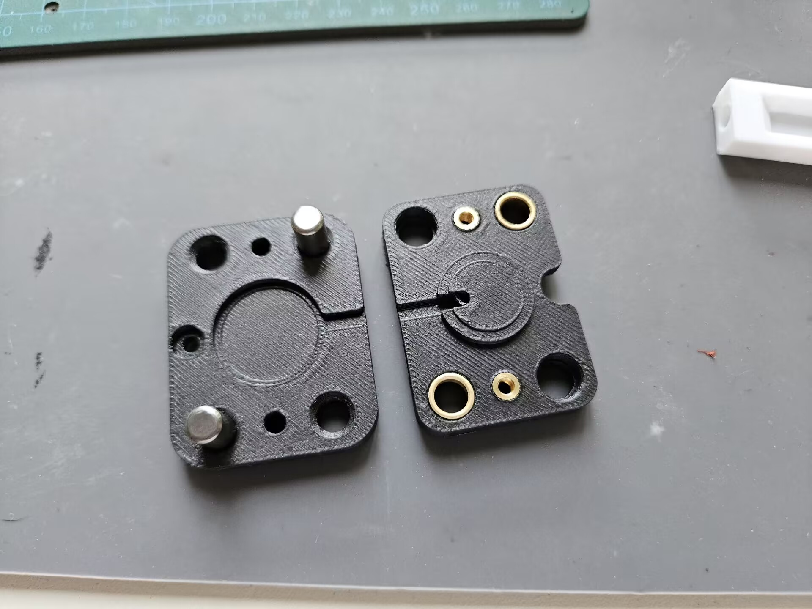
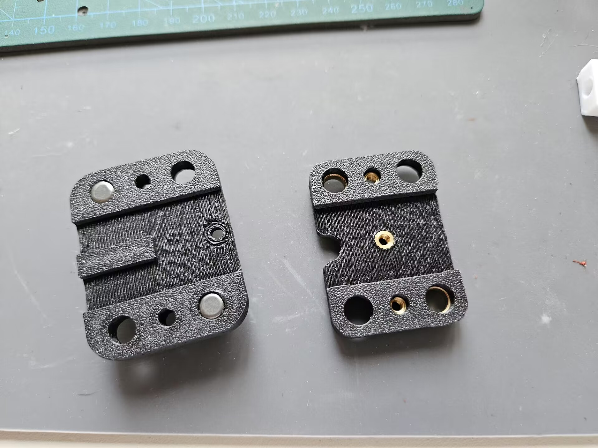
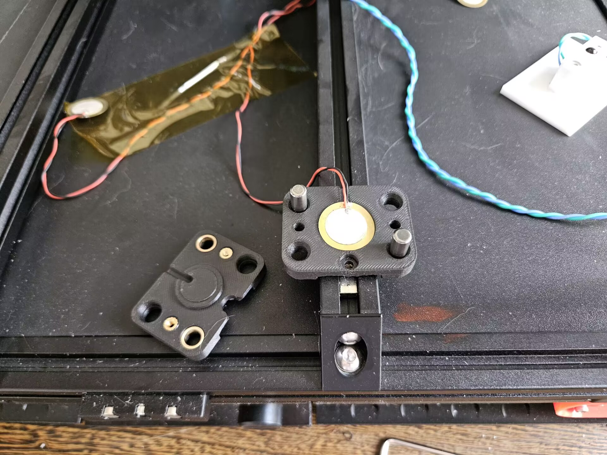
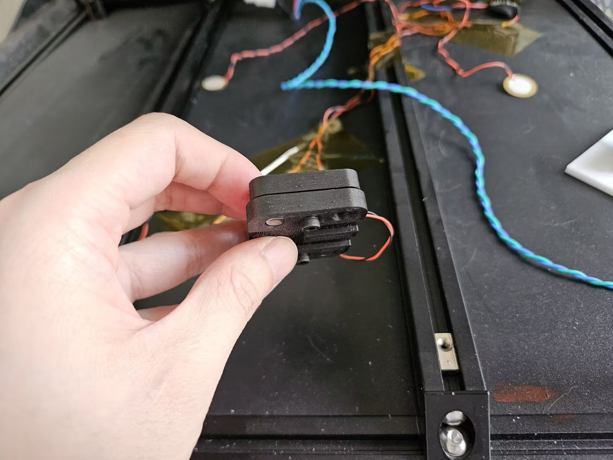
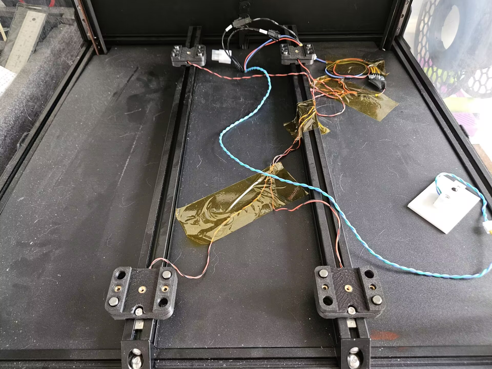
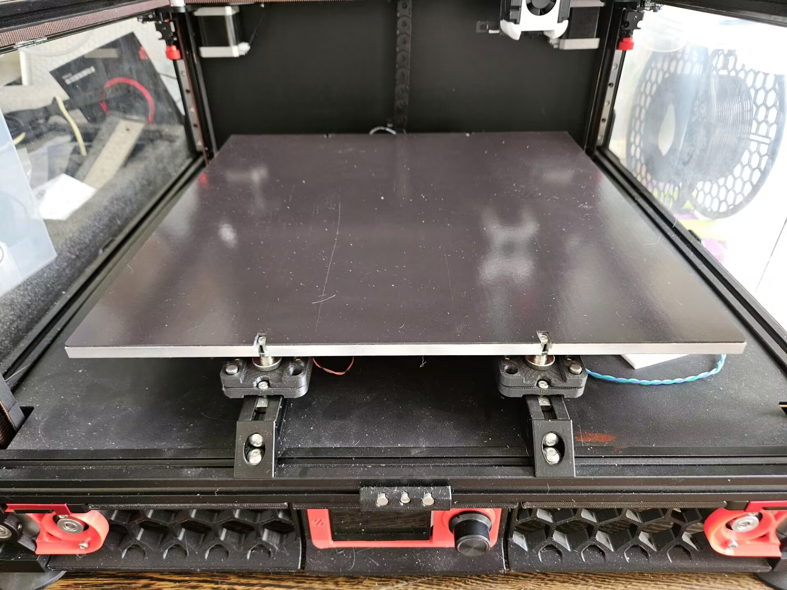

## 安装
1. 在下半部分安装光轴。用fitting.step来在插入光轴时辅助固定。
2. 安装热熔螺母和铜轴套。用toolchanger/ring_pusher.STEP来插入轴套。避免用任何硬质工具，否则可能会损伤轴套导致阻力增加！

3. 放入蜂鸣片，注意有陶瓷的一面朝上。

4. 拧上M3x10螺丝。不要拧紧！螺丝只是为了防止你在翻转打印机时热床脱落，不要对传感器施加任何压力。

5. 把传感器固定到型材上，并接好导线。

6. 拧上热床。
