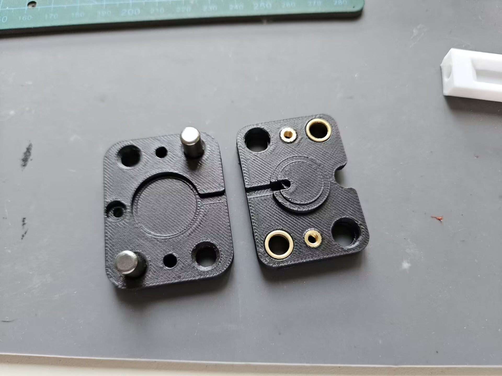
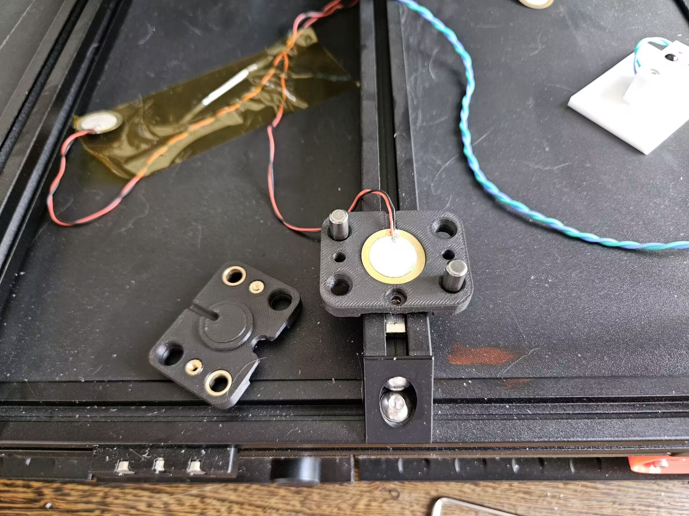

## Install
1. Install the linear guide rail on the bottom part. Use fitting.STEP to help pushing the rails in.
2. Install the heat set and bronze bearing. Use ring_pusher.STEP from toolchanger to help pushing the bearing in. Avoid using any metal tools to push the bearing in, otherwise you might damage it and increasing the friction!

3. Put the piezo disk in, make sure the ceramic side faces upwards

4. Put on M3x10 screws. Do not tighten! The screws are here to avoid heatbed falling down when you flip the printer over, do not apply any extra pressure to the sensor.

5. Mount the sensors on the extrusions and connect the wires

6. Put the heatbed on
