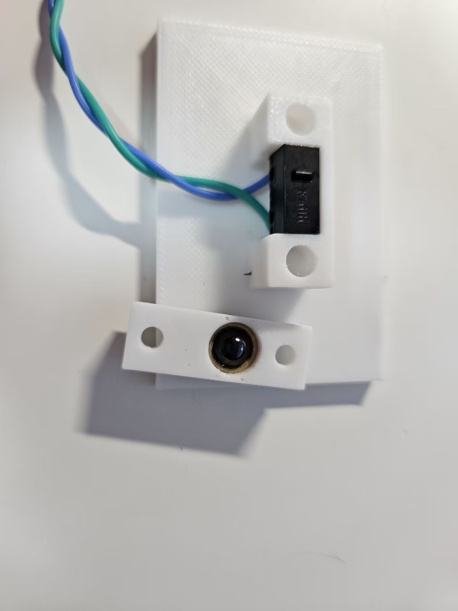
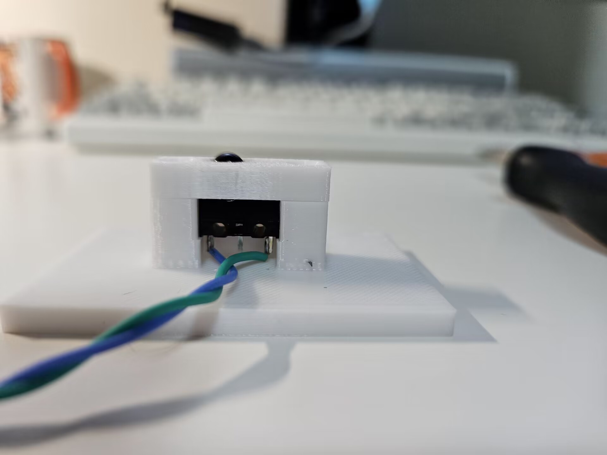

[Demo video](https://www.bilibili.com/video/BV1hH4y1u7oX/)

This is a simple but accurate nozzle alignment probe that works with [viesturz's NozzleAlign](https://github.com/viesturz/NozzleAlign).

Just clamp it to your heatbed and follows the instructions [here](https://github.com/viesturz/NozzleAlign/blob/main/README.md#klipper-integration).

