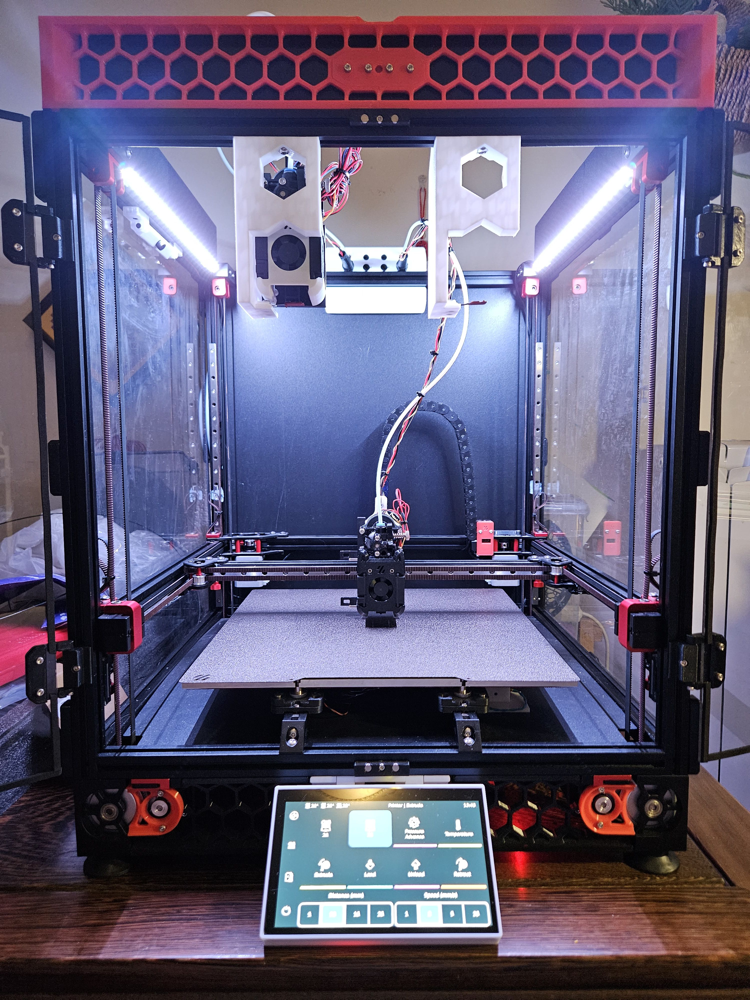
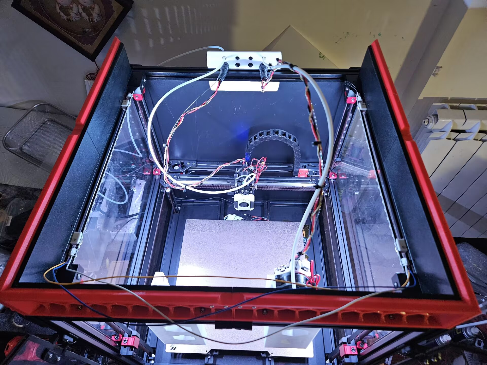

# FoxChanger
[中文版点我](./README.chs.md)

Voron 2.4/Trident tool changer mod inspired by Prusa XL toolchanger.

No customized/homemade metal parts required, 100% off-the-shelf parts without any post-processing/modification, except for 3d-printed parts of course.

[Demo video](https://www.bilibili.com/video/BV1c142117zm)

# Credit
This project is based on the following excellent works:
- [VORON Design](https://vorondesign.com/)
- [Klipper](https://www.klipper3d.org/)
- [Prusa Research](https://www.prusa3d.com/) for their Prusa XL, that created this toolhead locking mechanism
- [Viesturs Zariņš](https://github.com/viesturz) for tapchanger, klipper-toolchanger and nozzle align
- [3DUnplugged](https://www.youtube.com/channel/UCr8K1tva2CaEhyqNyaEjq_w) for his excellent analysis on Prusa XL's toolchanger, and his DAKSH tool changer V2 design
- [diedirk](https://www.printables.com/@diedirk_282928) for Sherpa Zero ECAS extruder
- [KayosMaker](https://github.com/KayosMake) for canboard mount
- [chirpy2605](https://github.com/chirpy2605) for the DragonBurner toolhead

# Hardware Overview
This mod contains the following 3 parts:
- Toolchanger: toolhead mount and dock
- Piezo bed sensor: piezo based z homing sensor under heatbed
- Nozzle align probe: micro-switch based multi-toolhead alignment tool

## Toolchanger
Currently this mod is designed around the Dragon Burner. Other toolheads might be used with different mount, however the size constraint needs to be considered. Also there will be no space to install the z proble inside the toolhead, or use Voron Tap for z homing, so a BambuLab P1/X1-like heatbed piezo sensor is used instead.

__Note: All shop links are not affiliate links! Just for examples!__

- Unmodified [Dragon Burner](https://github.com/chirpy2605/voron/tree/main/V0/Dragon_Burner), except the mount
- A slightly modified version of [Sherpa Zero ECAS extruder](https://www.printables.com/model/495935-sherpa-zero-ecas), thicker to support cloned BMG gears without grinding the gear shaft
- [Fly SHT-36 V2 CAN board](https://mellow-3d.github.io/fly-sht36_v2_general.html)
- A slightly modified version of [KayosMaker's CANboard_Mounts](https://github.com/KayosMaker/CANboard_Mounts), with a grove to attach the umbilical steel wire
- X carriage
  - 6\*8\*3(inner\*outer\*height) sintered porous bronze bearing (x3)
  - 2\*25(PHi\*length) stainless steel round head cylindrical positioning pin (x4)
  - 1\*8(PHi\*length) stainless steel round head cylindrical positioning pin (x4)
  - 0.3\*3\*5(PHi\*outer\*length) 304 stainless steel spring (x4)
  - M3\*8 SHCS (x4)
  - M3\*12 SHCS (x2)
  - M3 heat set insert (x2)
- Toolhead mount
  - 1\*2\*8\*1(short\*long\*width\*thickness) steel angle with 3mm holes (x2)
  - 6\*4\*8\*M3 cone head positioning pin (x3)
  - M3\*2\*5(thread\*length\*outer diameter) brass round column with threaded throughhole (x4)
  - M3\*5 set screw DIN (x2)
  - 3\*30(PHi\*length) stainless steel round head cylindrical positioning pin (x2)
  - 6\*3(PHi\*thickness) round magnet (x2)
  - M3\*6 FSHC (x5)
  - M3 heat set insert (x4)
- Dock
  - 3\*50(PHi\*length) stainless steel round head cylindrical positioning pin (x2)
  - 6\*3(PHi\*height) round magnet (x2)
  - 0.4\*5\*15(thickness\*width\*length) 301 stainless steel strip
  - [nozzle pad mold from TapChanger](https://github.com/viesturz/tapchanger/tree/f6a354f5bf93b9d8721f022794a41ad3e51c5828/Dock/Jigs)
  - [High temperature silicone adhesive](https://www.aliexpress.com/item/1005002418580570.html)
  - M3\*6 FSHC (x2)
  - M3\*12 SHCS (x1)
  - M5\*10 BHCS (x1)
  - M3 heat set insert (x2)
  - M3 T-nut (x1)
  - M5 T-nut (x1)

Note: Due to the extended latch, the gantry left XY joint needs to be modified, or use the CNC version like I did.

## Piezo bed sensor
Heatbed z probe sensor made with 4 20mm piezo disks and an off-the-shelf analog vibration sensor board.

- Piezoelectric Shock Tap Sensor, Vibration Switch Module like [this one](https://www.amazon.com/Rakstore-Piezoelectric-Vibration-piezoelectric-Percussion/dp/B09GX97X6B)
- 20mm piezo disk (x4)
- 6\*8\*3(inner\*outer\*height) sintered porous bronze bearing (x8)
- 6\*15(PHi\*length) linear guide rail (x8)
- M3\*8 SHCS (x4)
- M3\*10 SHCS (x8)
- M3 heat set insert (x8)
- M3 T-nut (x4)

## Nozzle align probe

- 6mm stainless steel ball (or Si3N4 ball like I'm using) (x1)
- Omron D2FC-f-7N micro-switch, or any other compatiable ones (x1)
- 6\*8\*3(inner\*outer\*height) sintered porous bronze bearing (x1)

# Print
Print most of the parts with the same settings as what Voron recommended.

I print most parts in PETG, except the latch, x carriage frame, dragon burner back plate and piezo probes which are printed in PETG-CF.

Print the latches in 100% infill and Arachne wall generator.

Most of the parts are designed to be printed without support, and some of them have built-in support.

I'll provide recommended print orientation inside each part's readme.

# Support this project
If you like my work, feel free to by me a coffe:

